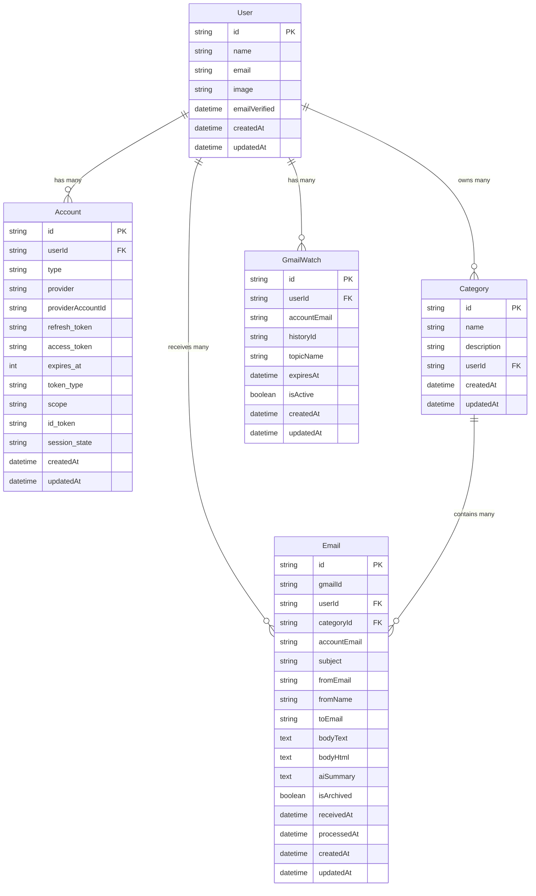

# Database Design - AI Email Sorter ⚡ **SIMPLIFIED ARCHITECTURE**

This document outlines the **streamlined** database schema design for the AI Email Sorter application, optimized for rapid development using Prisma ORM and NextAuth.js **JWT strategy**.

## Overview

The database is designed to support:
- Multi-user authentication via Google OAuth (**JWT strategy - no sessions table!**)
- Multiple Gmail accounts per user
- Custom email categories with AI-powered classification
- Email storage with AI-generated summaries
- Background job processing for email operations

## **🎯 Key Simplification: JWT Strategy Over Database Sessions**

**Removed Sessions Table** = **Major Development Speed Boost!**

✅ No session management complexity  
✅ Stateless authentication perfect for Vercel  
✅ NextAuth.js handles everything automatically  
✅ Focus on AI features, not auth plumbing  

## Entity Relationship Diagram



## Table Descriptions

### Core NextAuth.js Tables (JWT Strategy)

#### User
- **Purpose**: Stores user account information
- **Key Fields**:
  - `id`: Primary key (UUID)
  - `email`: User's primary email address
  - `name`: Display name from Google OAuth
  - `image`: Profile picture URL from Google

#### Account
- **Purpose**: Stores OAuth provider information (Google accounts)
- **Key Fields**:
  - `provider`: Always "google" for this app
  - `providerAccountId`: Google account ID
  - `access_token`: Gmail API access token (automatically refreshed by NextAuth.js)
  - `refresh_token`: Token for refreshing access (managed by NextAuth.js)
  - `scope`: Gmail permissions granted
- **Important**: NextAuth.js automatically handles token refresh - no manual logic needed!

### Application-Specific Tables

#### Category
- **Purpose**: User-defined email categories for AI classification
- **Key Fields**:
  - `name`: Category display name (e.g., "Work", "Newsletters")
  - `description`: Detailed description used by AI for classification
  - `userId`: Owner of the category

#### Email
- **Purpose**: Stores processed emails with AI analysis
- **Key Fields**:
  - `gmailId`: Original Gmail message ID
  - `accountEmail`: Which Gmail account received this email
  - `categoryId`: AI-assigned category
  - `aiSummary`: Gemini-generated summary
  - `bodyText/bodyHtml`: Original email content
  - `isArchived`: Whether email was archived in Gmail
  - `processedAt`: When AI processing completed

#### GmailWatch
- **Purpose**: Tracks Gmail push notification subscriptions
- **Key Fields**:
  - `accountEmail`: Gmail account being watched
  - `historyId`: Last processed Gmail history ID
  - `topicName`: Pub/Sub topic name
  - `expiresAt`: When watch expires (7 days max)
  - `isActive`: Whether watch is currently active

## Design Decisions

### 1. **JWT Strategy Over Database Sessions** 🚀
- **No Sessions table needed** - NextAuth.js handles session state in secure JWTs
- **Stateless authentication** perfect for serverless deployment
- **Automatic token refresh** without database overhead
- **Faster development** - focus on core features instead of session management

### 2. Multi-Account Support
- Users can connect multiple Gmail accounts via the `Account` table
- Each `Email` record tracks which account received it via `accountEmail`
- Separate `GmailWatch` records for each connected account

### 3. AI Processing Fields
- `Email.aiSummary` stores Gemini-generated summaries
- `Category.description` provides context for AI classification
- `Email.processedAt` tracks processing completion

### 4. Gmail Integration
- `Email.gmailId` enables operations on original Gmail messages
- `Email.isArchived` tracks Gmail archiving status
- `GmailWatch` manages push notification lifecycles

### 5. Scalability Considerations
- Indexed foreign keys for efficient queries
- Separate processing timestamp for performance monitoring
- Atomic operations for email state management

## Indexes and Performance

### Recommended Indexes
```sql
-- User email lookups
CREATE INDEX idx_email_user_account ON Email(userId, accountEmail);

-- Category filtering
CREATE INDEX idx_email_category ON Email(categoryId);

-- Gmail ID lookups for operations
CREATE UNIQUE INDEX idx_email_gmail_id ON Email(gmailId);

-- Watch management
CREATE INDEX idx_gmail_watch_active ON GmailWatch(isActive, expiresAt);

-- Note: No session or verification token indexes needed with JWT strategy!
```

## Data Flow

1. **User Authentication**: Google OAuth creates `User` and `Account` records (NextAuth.js handles JWT sessions)
2. **Gmail Watch Setup**: `GmailWatch` record created for push notifications
3. **Email Reception**: Webhook triggers background job
4. **Email Processing**: 
   - Fetch email via Gmail API (using NextAuth.js managed tokens)
   - AI categorization and summarization
   - Store in `Email` table
   - Archive in Gmail
5. **User Interaction**: Query emails by category, perform bulk operations

## Security Considerations

- OAuth tokens stored securely in `Account` table and managed by NextAuth.js
- **JWT sessions** stored in secure, signed cookies
- Email content encrypted at rest (database level)
- User isolation enforced via foreign key constraints
- **No custom session or verification token logic** reduces security vulnerabilities

## **Perfect for 72-Hour Challenge Benefits** 🏆

| **Benefit** | **Description** |
|-------------|-----------------|
| ⚡ **Faster Development** | No session or verification token table complexity |
| 🔍 **Easier Debugging** | Fewer database tables to manage |
| 🚀 **Better Performance** | No session or verification token queries |
| ☁️ **Vercel-Optimized** | Stateless = perfect for serverless |
| 🔒 **Secure by Default** | NextAuth.js handles JWT security |
| 📈 **Auto-Scaling** | No session or verification token cleanup required |

## Migration Strategy

The schema is implemented with **maximum simplicity**:
1. ✅ NextAuth.js core tables (User, Account)
2. ✅ Category management
3. ✅ Email processing tables
4. ✅ Gmail watch management
5. ✅ Performance indexes
6. ❌ **NO Sessions or VerificationToken table** - JWT handles everything!

## **Development Speed Focus** 🎯

This simplified architecture allows you to:
- **Start coding features immediately**
- **Deploy without session or verification token management concerns**
- **Scale without database session or verification token overhead**
- **Focus 100% on AI email processing features**

Perfect for building an impressive AI email sorter in just 72 hours! 🚀 